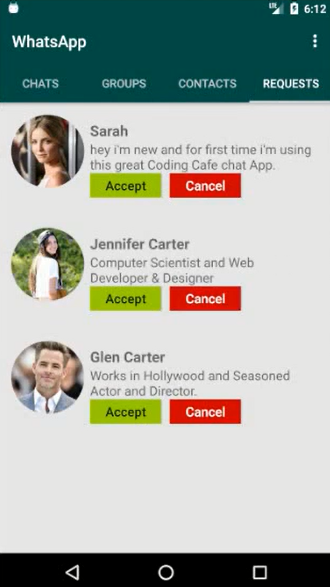
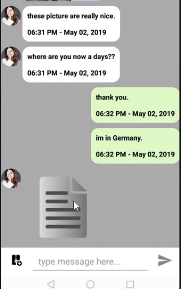
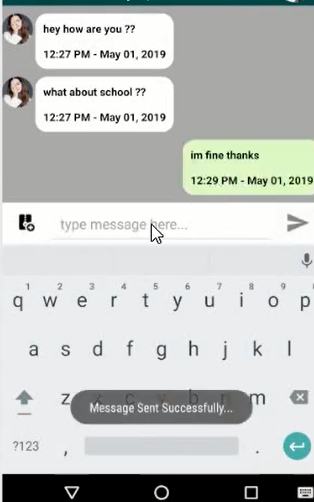

# ChatApplication
This Chat application helps to communicate people from one another. This application works when there is internet connection available in the phone. Through this chat application user can send important messages, videos, images, audio files to another person. This application is developed on android platform.
In this application we are using a real time database which is firebase in which user login name and password will be stored also it will store all the messages done between two people.

# Register Page

# Login Page

# Friend Request Page

# Contact Page

# Chat Page

# Profile Page

